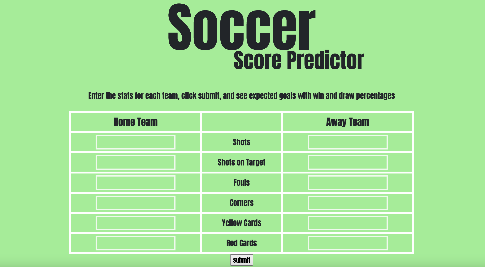
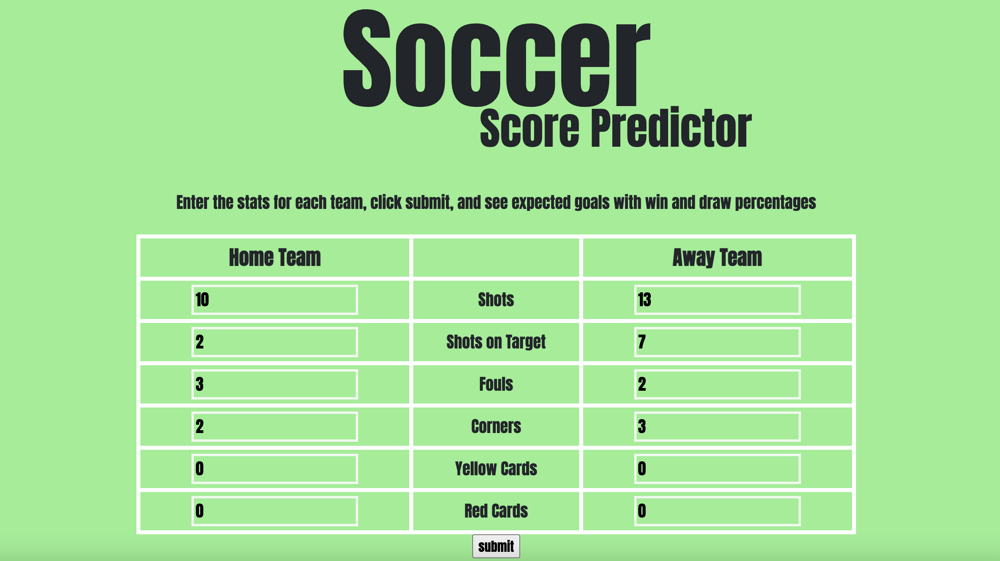

# Soccer Score Predictor

The Soccer Score Predictor is an interactive web app that allows users to enter the box score of a soccer game and get the expected goals for the home and away teams as well as predicted win, loss, and draw percentages.

The Soccer Score Predictor implements Machine Learning (ML) algorithms applied to English Premier League (EPL) soccer games.

## Technologies Used

I used Python (pandas) to load and preprocess the EPL game data; Python (scikit-learn) to test, implement, validate ML models; HTML/CSS for frontend web dev and design; Google Cloud Platform to deploy the application as a public website.

## Link:
https://soccer-predictor-397605.uw.r.appspot.com/
*it may take several seconds to load

## Screenshots

